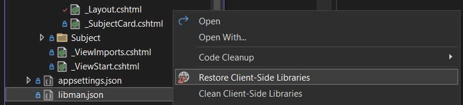

# ITPE3200 - Flashcards

This projects is our first group project in the course ITPE3200 - Web Application Development at OsloMet.
Documentation for the project can be read [`here`](https://github.com/GulluzarA/Flashcards/tree/main/Documentation).

## Table of contents
* [Project description](#project-description)
* [Developer guide](#developer-guide)
    * [Sass](#sass)
    * [Migrations](#migrations)
    * [Restore client side libraries locally](#restore-client-side-libraries-locally)

## Project description

The project is a web application for creating and sharing flashcards.
The application is built using ASP.NET Core MVC and Entity Framework Core.

## Developer guide

### Sass

.scss files need to be compiled to .css files.
This is not done automatically when running the application and needs to be done before committing your changes.
This can be done by running the following terminal command locally (in the Flashcards folder).

```
sass --watch wwwroot/scss/custom.scss wwwroot/css/custom.css 
```

If you dont have sass install you can install it using the command (requires npm)

```
npm install -g sass
```

### Migrations

In dev mode pending migrations are run automatically during database seeding (DBInit.cs).
If your local database has had migrations applied that are not included in the branch you are currently checking out,
you can simply delete the local database and run the application again to create a new one.

Changes to the Models or FlashcardsDbContext requires a migration to be created and applied to the database.
This is done by running the following terminal commands locally (int the Flashcards folder).
Making sure to replace **MigrationName** with a name that describes the changes made.

```powershell
dotnet ef migrations add FlashcardsDbMigrationName
dotnet ef database update
```

If you dont have the dotnet ef tool installed, run the following command:

```powershell
dotnet tool install --global dotnet-ef
```

### Restore client side libraries locally

To Restore client side libraries locally, right click on libman.json file and Restore client-side libraries.



